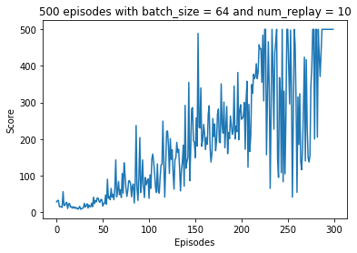

# Cartpole-Expected-Sarsa
Solving Gym cartpole environment with Asynchronous Deep Expected Sarsa with replay buffer

Results :

Training took 30 minutes.

Basic model for basic environment

See the notebook for more.
